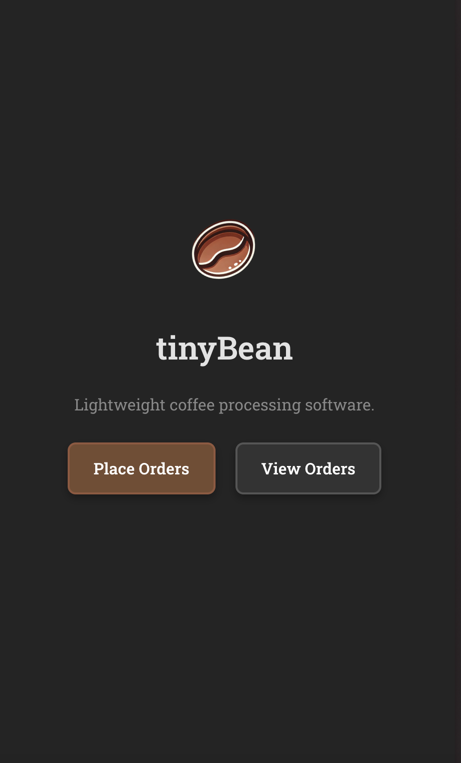
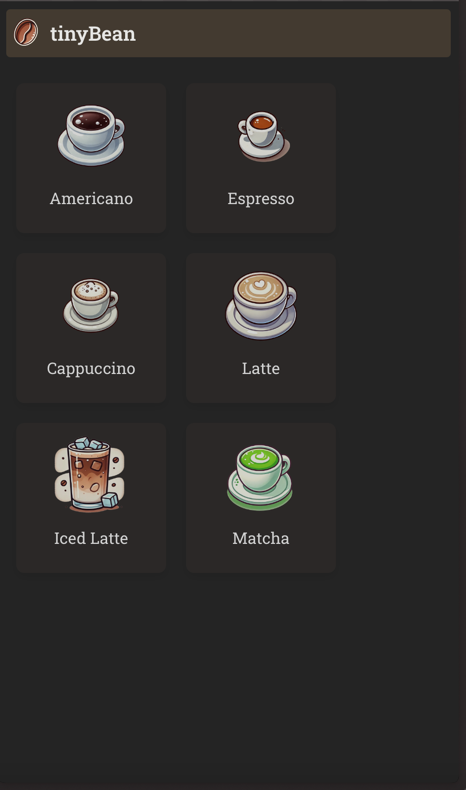
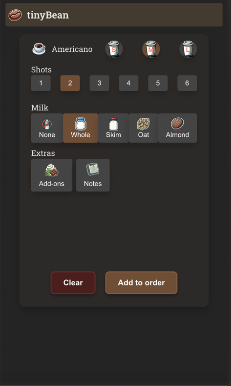

<!DOCTYPE html>
<html lang="en">
<head>
    <meta charset="UTF-8">
    <meta name="viewport" content="width=device-width, initial-scale=1.0">
    <title>tinyBean</title>
    
</head>
<body>
    

        
tinyBean

        
    

</body>
</html>

### Description

It's literally just a wee web app that lets you select, configure and place coffee orders. One page to do that and
another to have the orders displayed.

### Motivation

I was in my favourite coffee shop and was watching them fuck about writing down coffee orders on scrap bits of paper and
thought - I can definitely spend 100s of hours fixing that small problem.

### Stack

* Server
    * Rust with Axum, Tower and Tokio.
    * SQLite DB.
* UI
    * Typescript with React, React Query and Zustand.
    * Vite for build and serve tings.

### Deployment

I've built this whole thing around the prospect of running it locally on a Raspberry Pi Zero lol. You can check out the
specifics in the `build_and_ship.sh` scripts in both UI and server directories. But the TL;DR is:

* Set-up Raspberry Pi Zero to connect to Wifi and be available locally at `tinybean.local`. So if you're on the same
  Wifi network, you can access your tinyBean instance.
* UI is built using Vite, spits out a tidy little dist folder containing HTML, CSS, JS and assets.
* Directory gets zipped up and `scp`'d across to the pi.
* Server is built using `cargo` and the `cross` build tool (nice little build target abstraction CLI tool).
* Pretty lean server binary is produced (ye don't even need rust installed/configured on the Pi!) and `scp`'d across to
  the server.
* Set-up the Pi's systemd to run the server binary on boot.
* Server hosts the UI files under the `/static/` route and serves the API on `/api/`.
* You can now access your tinyBean instance at `tinybean.local`.

### Future Development

* Integrate UI and server.
    * First port of call will be the creation and storage of orders.
* Build out "View Orders" page.
* Analytics???
* Add some tests lol.
* Sell to Google for $1bn.

### Current Look

